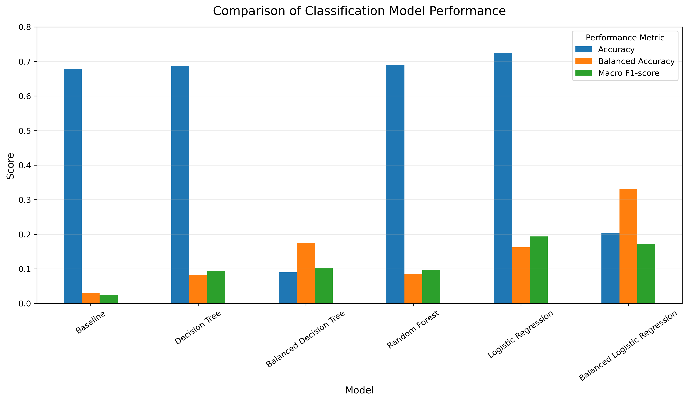

# Cuisine Classification Using Recipe Ingredients

## Overview

This project applies supervised machine learning to predict the cuisine of a recipe based on the ingredients used.

The analysis was developed from coursework undertaken as part of the IBM Data Science Professional Certificate and expanded into a complete portfolio project covering data understanding, data preparation, exploratory analysis, modelling, evaluation, model interpretation, and reproducibility.

The project demonstrates how ingredient patterns can be used to distinguish among cuisine categories while also highlighting the challenges created by severe class imbalance.

## Business Question

**Can the cuisine of a recipe be automatically predicted from the ingredients used in the recipe?**

This was formulated as a supervised multiclass classification problem in which:

- **Target:** Cuisine
- **Predictors:** 383 binary ingredient indicators
- **Unit of analysis:** Individual recipe

## Dataset

The original dataset contains:

- **57,691 recipes**
- **384 variables**
- **1 cuisine variable**
- **383 ingredient indicators**

Ingredient variables indicate whether a particular ingredient is present in a recipe.

After standardizing cuisine labels and excluding categories represented by 50 or fewer recipes, the analytical dataset contained:

- **57,403 recipes**
- **34 cuisine categories**
- **383 ingredient predictors**

Exact duplicate observations were retained during exploratory analysis but removed from the modelling dataset to reduce the possibility of identical ingredient profiles appearing in both the training and test sets.

## Project Workflow

The project follows a structured data science workflow:

1. Business understanding
2. Data understanding
3. Data loading and inspection
4. Data quality assessment
5. Data preparation
6. Exploratory data analysis
7. Machine learning modelling
8. Model evaluation and interpretation
9. Conclusions and recommendations

## Exploratory Analysis

The dataset is highly imbalanced, with American cuisine representing approximately 70% of the analytical observations.

Frequently occurring ingredients include:

- Egg
- Wheat
- Butter
- Onion
- Garlic
- Milk
- Vegetable oil
- Cream
- Tomato
- Olive oil

Cuisine-specific analysis revealed distinctive ingredient patterns. Examples include:

- **Italian:** olive oil, parmesan cheese, basil
- **Mexican:** cayenne, cumin, cilantro, avocado
- **Indian:** turmeric, cardamom, cumin, coriander
- **Chinese:** soy sauce, sesame oil, ginger
- **Japanese:** seaweed, sake, soy sauce, kelp

The exploratory analysis also showed that some ingredients are common across many cuisines, while others provide stronger cuisine-specific signals.

## Models Evaluated

Six classification approaches were compared:

- Baseline classifier
- Decision Tree
- Class-Balanced Decision Tree
- Random Forest
- Logistic Regression
- Class-Balanced Logistic Regression

## Model Performance

The evaluated models produced the following results:

| Model | Accuracy | Balanced Accuracy | Macro F1 |
|---|---:|---:|---:|
| Baseline | 0.6788 | 0.0294 | 0.0238 |
| Decision Tree | 0.6876 | 0.0834 | 0.0932 |
| Balanced Decision Tree | 0.0901 | 0.1751 | 0.1027 |
| Random Forest | 0.6900 | 0.0860 | 0.0962 |
| Logistic Regression | **0.7246** | 0.1622 | **0.1936** |
| Balanced Logistic Regression | 0.2032 | **0.3312** | 0.1717 |

The ordinary **Logistic Regression model** was retained as the primary model because it provided the strongest overall combination of accuracy, macro F1-score, interpretability, and multiclass predictive performance.

The class-balanced Logistic Regression substantially improved recognition of minority cuisine categories, as reflected in its higher balanced accuracy, but this improvement came at a major cost to overall accuracy.

### Model Performance Comparison



## Key Findings

- Recipe ingredients contain useful information for predicting cuisine.
- Logistic Regression outperformed the tree-based models on overall accuracy and macro F1-score.
- Severe class imbalance strongly influenced model behaviour.
- The model performed particularly well for American, Indian, and Mexican cuisines.
- Several minority cuisine categories remained difficult to classify reliably.
- American cuisine was frequently predicted when the model was uncertain, reflecting the dominance of the majority class.
- Ingredient prevalence and predictive importance are not necessarily the same.
- Logistic Regression coefficients provided interpretable cuisine-specific ingredient signals.

## Model Interpretation

Logistic Regression coefficients were examined to identify ingredients that contributed most strongly to selected cuisine predictions.

Examples of strong positive predictors include:

- **Italian:** parmesan cheese, grape brandy, truffle, romano cheese, olive oil
- **Mexican:** tequila, cheddar cheese, cayenne, avocado, corn
- **Indian:** cardamom, yogurt, turmeric, cashew, cumin
- **Chinese:** soy sauce, star anise, peanut oil, black bean, sesame oil
- **Japanese:** seaweed, sake, soy sauce, green tea, kelp

These coefficients represent **predictive association rather than causation**.

An important distinction emerged between ingredient prevalence and predictive importance. Some ingredients that were not among the most common within a cuisine still received large positive coefficients because they were useful for distinguishing that cuisine from others.

## Visualisations

The project includes several portfolio-quality visualisations, including:

- Cuisine distribution
- Top 20 ingredients
- Cuisine ingredient profiles
- Distinctive ingredient lift
- Decision Tree confusion matrix
- Focused Logistic Regression confusion matrix
- Predictive ingredient coefficients
- Final model performance comparison

Generated figures are stored in the `images/` directory.

## Technologies Used

- Python
- Jupyter Notebook
- pandas
- NumPy
- Matplotlib
- scikit-learn

## Project Structure

```text
cuisine-classification/
│
├── README.md
├── data/
│   └── recipes.csv
├── images/
├── notebooks/
│   └── cuisine_classification.ipynb
└── docs/
```
## Reproducibility

The notebook uses project-relative paths so that the analysis can be rerun from a fresh Jupyter kernel.

To reproduce the analysis:

1. Clone or download the project.
2. Ensure the dataset is available as `data/recipes.csv`.
3. Open `notebooks/cuisine_classification.ipynb`.
4. Restart the kernel.
5. Run all cells from top to bottom.

The notebook has been tested from a fresh kernel and executes successfully from beginning to end.

## Limitations

The main limitations of the project include:

- Severe class imbalance
- Binary ingredient indicators without ingredient quantities
- Overlap among related cuisine categories
- Small sample sizes for some minority cuisines
- Cuisine-label harmonization
- Limited hyperparameter optimization
- A limited range of classification algorithms

## Future Improvements

Future work could explore:

- More advanced techniques for handling class imbalance
- Cross-validation and systematic hyperparameter tuning
- Gradient boosting models
- Support vector machines
- Ingredient quantities and preparation methods
- Recipe-text features
- Hierarchical cuisine classification
- A user-facing cuisine prediction application

## Data Source

The dataset used in this project is associated with the recipe and ingredient data used in the IBM Data Science Professional Certificate exercises and with research on culinary ingredient networks.

Ahn, Y.-Y., Ahnert, S. E., Bagrow, J. P., & Barabási, A.-L. (2011). *Flavor network and the principles of food pairing*. Scientific Reports, 1, 196.

[http://yongyeol.com/papers/ahn-flavornet-2011.pdf](http://yongyeol.com/papers/ahn-flavornet-2011.pdf)

## Author

**Michael Malusi Mwangangi**

Portfolio Project 01  
Data Science & Machine Learning
